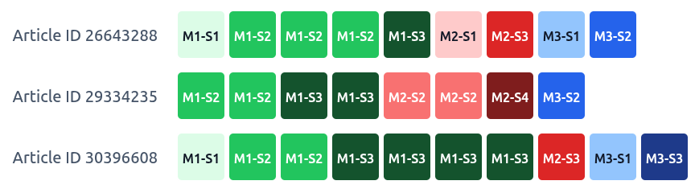
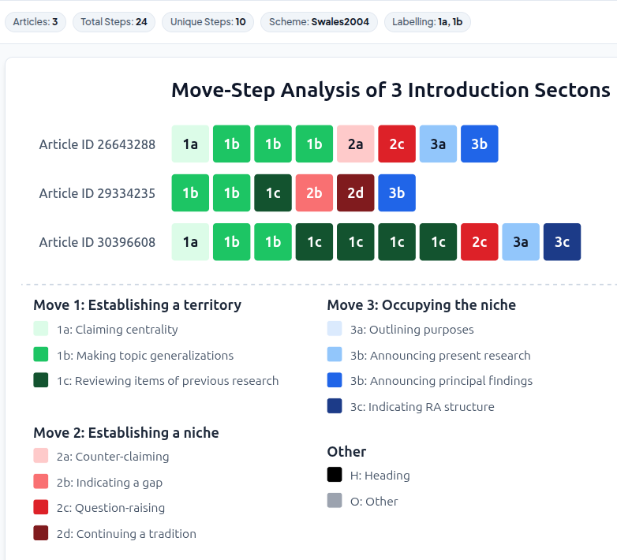

```{=html}
<div class="title-slide-container">
  <div class="title-header">
    <a href="https://blogs.ulster.ac.uk/eurocallconference2026/" target="_blank" rel="noopener noreferrer">
      
    </a>
    <div class="eurocall-title-text">EuroCALL 2026 | Belfast</div>
  </div>

  <div class="title-main-block">
    <h1 class="title-heading">Visualizing the DNA of Discourse</h1>
    <h3 class="title-subheading">Sequencing Rhetorical Moves and Steps in Python</h3>
    <div class="title-author-text">Charles Lam, University of Leeds</div>
    <div><a href="mailto:c.lam@leeds.ac.uk">c.lam@leeds.ac.uk</a></div>
  </div>

  <div class="title-footer">
    
  </div>
</div>
```

---

## Overview

- The Pedagogical Challenge: Making academic discourse explicit
- Solution: Visualizing the Move-Step Analysis
- **MoveStepViz** 
  - Visualization tool inspired by Multiple Sequence Alignment (MSA) in bioinformatics
  - Decoding and displaying rhetorical structure at a glance
- Implications: 
  - Data-driven learning (DDL) for genre knowledge 
  - Potentials with genre analysis with AI-annotation
  

# The Pedagogical Challenge {background-color="#cbd5e1"}
                                                                                                                                                                                
## Why Novice Writers Struggle with Genre?

Novice and L2 academic writers often struggle to replicate the rhetorical expectations of research genres.

- Students know they need to "provide background," but miss **how** it is done and what counts as appropriate presentation of background in academic writing
  * My teaching context: ESAP in STEM MSc in the UK, non-credit bearing module

- Rhetorical moves & steps are often **implicit** and the ordering can be discipline-specific.

- Limited exposure to discourse / narrative in STEM disciplines (Falconer 2022; Ou & Söderlindh 2026)

- Explicit instruction and demonstration have been shown to benefit rhetorical strategies (Flowerdew 2000; Cheng 2007; 2008)


## What is Move-Step Analysis? 

::: {.columns}
::: {.column width="45%" .scrollable-col}
::: {.callout-note}
### Swalesian CARS Model (1990; 2004)

* **Move 1: Establishing a territory**
  * *Step 1*: Claiming centrality
  * *Step 2*: Making topic generalizations
  * *Step 3*: Reviewing previous research
* **Move 2: Establishing a niche**
  * *Step 1*: Counter-claiming
  * *Step 2*: Indicating a gap
  * *Step 3*: Question-raising
  * *Step 4*: Continuing a tradition
* **Move 3: Occupying the niche**
  * *Step 1a*: Outlining purposes 
  * *Step 1b*: Announcing present research
  * *Step 2*: Announcing principal findings
  * *Step 3*: Indicating research article structure
:::
:::

::: {.column width="50%"}

::: {.r-stack .sample-stack}
::: {.fragment .fade-out fragment-index=1}
::: {.sample-text-box .sample-text-unannotated}
<p>"In recent years, AI-assisted language learning has attracted widespread attention in applied linguistics.</p>

<p>Novice researchers often find mastering academic genre conventions challenging.</p>

<p>Previous studies (e.g., Swales, 1990; Cotos et al., 2017) have highlighted the role of rhetorical move patterns."</p>
:::
:::

::: {.fragment .fade-in fragment-index=1}
::: {.sample-text-box}
::: {.step-block .step-1-highlight}
"In recent years, AI-assisted language learning has attracted widespread attention in applied linguistics. <span class="step-badge step-1-badge">Step 1</span>
:::

::: {.step-block .step-2-highlight}
Novice researchers often find mastering academic genre conventions challenging. <span class="step-badge step-2-badge">Step 2</span>
:::

::: {.step-block .step-3-highlight}
Previous studies (e.g., Swales, 1990; Cotos et al., 2017) have highlighted the role of rhetorical move patterns." <span class="step-badge step-3-badge">Step 3</span>
:::
:::
:::
:::

<!-- ::: {.fragment .fade-in fragment-index=1}
<ul class="step-legend-list">
  <li class="legend-step-1"><span class="legend-dot legend-dot-1"></span><strong>M1-Step 1: Claiming centrality</strong></li>
  <li class="legend-step-2"><span class="legend-dot legend-dot-2"></span><strong>M1-Step 2: Topic generalization</strong></li>
  <li class="legend-step-3"><span class="legend-dot legend-dot-3"></span><strong>M1-Step 3: Reviewing previous research</strong></li>
</ul>
::: -->

::: {style="color: #64748b; font-size: 0.85em; margin-top: 0.5rem;"}
By labelling the Moves and Steps, researchers have the tools to investigate (i) how these typical components are ordered and (ii) how they are realized in language. 
:::
:::
:::

## Multiple Sequence Alignment (MSA) 

:::: {.columns}
::: {.column width="50%"}
{width="95%"}

* Aligns DNA/RNA/amino acid sequences into colour-coded blocks.
* Reveals patterns, mutations, and conservation across organisms, by comparing rows. 
:::

::: {.column width="50%"}
::: {.fragment}

::: {.callout-note}
### The "DNA of Discourse"
**Multiple Sequence Alignment** in biology translates directly to **Rhetorical Sequence Alignment** in language education:
:::

* Like organisms, texts contain basic components that often display a **normal**, **typical** order. 
* By visualizing the pattern, users can compare similarity and diversity. 

:::

:::
::::

# Introducing MoveStepViz {background-color="#cbd5e1"}

## MoveStepViz

A pedagogical visualization toolkit designed for language educators, students, and corpus linguists.

::: {.columns}
::: {.column width="50%"}
### Python Package (`movestepviz` v0.2.3)
* Open-source on PyPI
* Generates publication-ready DNA-strip diagrams.
* Pre-loaded with frequently-used rhetorical schemes (CARS, DRaC).
* Fully customizable colours, labels, and layouts.
:::

::: {.column width="50%"}
### Web Interface
* User-friendly interface for teachers and students
* Interactive exploration
* Drag-and-drop custom annotation upload
:::
:::

---

## Visualizing Moves and Steps 

Similar to a DNA sequence, a row represents a unit containing foundamental elements:  

::: {style="text-align: center;"}
{width="50%"}
:::

* Each Move has a distinct color (Green = M1, Red = M2, etc.)
* Steps within the same move share shades of the family for intuitive hierarchy
* Readable In-Cell Labels (e.g. `M1-S1`, `M1-S2`, `M2-S1`, `M3-S1`)


::: {.fragment}
**This provides users an overview of the progression of moves, while keeping track of the exact steps used.**

- Some steps repeat 
- Some steps are optional
:::

## Pre-loaded Genre & Section Schemes

<br>

| Scheme | Research Article Section | Foundational Research |
| :--- | :--- | :--- |
| **`Swales2004`** | **Introduction** (CARS model) | Swales (1990, 2004) |
| **`Cotos_etal2017`** | **Methods** (DRaC model) | Cotos, Huffman, & Link (2017) |
| **`Yang_Allison2003_Results`** | **Results** | Yang & Allison (2003) |
| **`Yang_Allison2003_Discussion`** | **Discussion** | Yang & Allison (2003) |

<br><br>

| **Custom Schemes** | Any user-defined annotation scheme in CSV or JSON |

## More Customization

::: {.columns}
::: {.column width="40%"}
  * Export of figure in various formats (JPG, PNG, SVG) 
  * Display and labelling options (`M1-S3` vs. `1c` vs. `1.3`)
  * Custom colour palette to highlight particular moves/steps
  * Basic statistics of steps (# of texts, # of steps, # of unique steps) 
  * Normalized Width mode (for longer sections)  

:::

::: {.column width="60%"}
  {width="90%"}
:::
:::

# More Intuitive Input to MoveStepViz? {background-color="#cbd5e1"}

## Web Interface 
Demo: <https://charles-lam.net/movestepviz/>{target="_blank"}

<iframe 
  src="https://charles-lam.net/movestepviz/" 
  style="width: 100%; height: 700px; border: 0.5px solid #94a3b8; border-radius: 8px; background: #ffffff; box-shadow: 0 4px 12px rgba(0,0,0,0.08);"
  allow="clipboard-write">
</iframe>


# Implications {background-color="#cbd5e1"}

## Data-Driven Learning for Genre Knowledge

* With realistic examples, students are able to see how attested examples conform to the idealized models or how / where particular steps deviate from the norm. 
* Potential to visualize student writing (requires further annotation)
* Also: length of consecutive sentences for particular moves and steps can be useful for novice writers.  

## Educator as Developer

*Educator have always been developers:* 

* Making meaning (backend logic) visible with form (frontend interaction)
* Anticipating & accommodating different 'user behaviours'
* Constant error handling, adaptation & updating

:::: {.callout-lg .fragment}
::: {.callout-note}
## What AI-Assisted Programming Buys Us
- Rapid prototyping & builds
- Reduced technical challenge  
- More time for creating bespoke tools 
  * understanding of student needs   
  * educators' domain expertise 
:::
::::


# Summary & Takeaways {background-color="#cbd5e1"}

1. Making Rhetoric Moves-Step Analysis Visible
2. Flexible Adoption (web interface & Python package `movestepviz`) 
3. Empowering CALL Educators with custom tools for their own classroom needs
4. **Next step**: Connecting with automated annotation! 

## Thank You! Questions and Comments Are Welcome!

::: {.columns}
::: {.column width="55%"}
::: {style="font-size: 0.8em; max-height: 460px; overflow-y: auto; padding-right: 15px;"}

**References**

  Cheng, A. (2007). Transferring generic features and recontextualizing genre awareness: Understanding writing performance in the ESP genre-based literacy framework. *English for specific purposes, 26*(3), 287-307.

  Cheng, A. (2008). Analyzing genre exemplars in preparation for writing: The case of an L2 graduate student in the ESP genre-based instructional framework of academic literacy. *Applied linguistics, 29*(1), 50-71.

  Cotos, E., Huffman, T., & Link, S. (2017). *Research article abstracts as genre-specific texts: The generic-specific analysis (GSA)*. English for Specific Purposes, 46, 50-63. 

  Dudley-Evans, T., & St John, M. J. (1998). *Developments in English for specific purposes: A cross-curricular approach*. Cambridge University Press. 

  Falconer, H. M. (2022). *Masking Inequality with good intentions: Systemic bias, counterspaces, and discourse acquisition in STEM Education*. WAC Clearinghouse. <https://wacclearinghouse.org/docs/books/masking/inequality.pdf>

  Flowerdew, L. (2000). Using a genre-based framework to teach organizational structure in academic writing. *ELT journal, 54*(4), 369-378.

  Ou, A. W., & Söderlindh, L. (2026). The complexity of disciplinary literacy and identity in STEM: A case study of student language use in project-based learning. *Linguistics and Education, 95*, 101581. <https://doi.org/10.1016/j.linged.2026.101581>

  Propp, V. (1968[1928]). *Morphology of the Folktale* (2 ed.), translated by L. Scott. University of Texas Press.

  Swales, J. M. (1990). *Genre analysis: English in academic and research settings*. Cambridge University Press. 

  Swales, J. M. (2004). *Research genres: Explorations and applications*. Cambridge University Press. 

  Yang, R., & Allison, D. (2003). *Research articles in abstracts: Structure, patterns of move-step organization, and their pedagogical implications for ESP*. English for Specific Purposes, 22(2), 127-148. 
:::
:::

::: {.column width="45%"}
### Project Resources
* **Web App & Slides**: [charles-lam.net/presentations/eurocall2026](https://charles-lam.net/presentations/eurocall2026/)
* **PyPI Package**: `pip install movestepviz` 
* **Package Documentation**: [pypi.org/project/movestepviz/](https://pypi.org/project/movestepviz/)
:::
:::


# Further Discussion {background-color="#FFFFC5"}

## Inclusivity and Support for Novice Writers
- Genre knowledge is rarely taught explicitly in STEM curriculum
  * Needs of MSc level students are different from UG 
  * Sub-disciplinary differences (Biomedical vs. web lab disciplines vs. bioinformatics)
- Novice writers, not just writers / language users with backgrounds in other languages (or "international students")
  * "Home students" could use a lot of help too, especially in STEM disciplines.    

- Addressing diversity in disciplines (by identifying various patterns and empirically how they differ from the idealized 'models')


## Potential Use beyond Genre in EAP 

* Narrative structure & progression (Formal structure in Russian formalism, Propp 1968[1928])

* Interactions and turn-taking 

  - Move:Step :: Speaker:Interactive device/patterns
